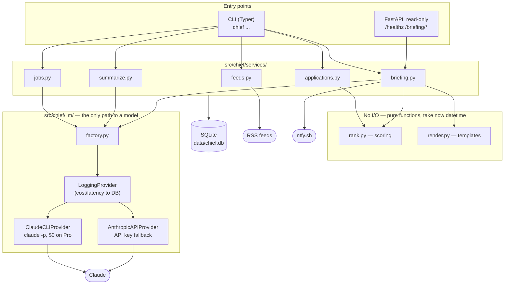
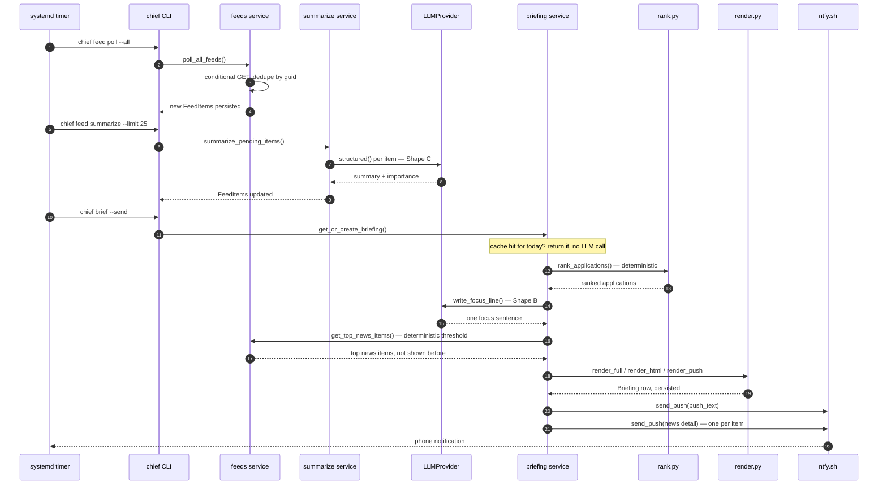
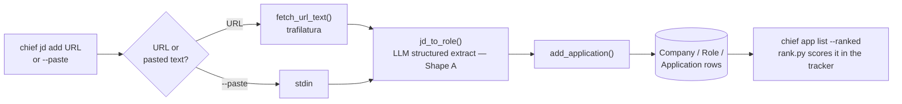

# Chief

[](https://github.com/CharuchithRanjit/MBA-Collector-Agent/actions/workflows/ci.yml)
[](LICENSE)

A personal career agent for MBA recruiting. Single user, runs on one
small EC2 box, built around one question: **what's the single most
important thing to do today, and why?**

Everything else — the tracker, the extraction, the ranking — exists to
make that morning answer correct without typing anything in.

## What it does

- **Application tracker** — companies, roles, deadlines, next actions,
  pipeline stage. Deterministic, no AI.
- **JD ingest** — paste a link or raw text; a structured role (company,
  title, deadline, requirements) is extracted automatically.
- **RSS feed ingest** — polls feeds with conditional GET (etag/guid
  dedup), summarizes new items, and scores their relevance.
- **Deterministic ranking** — the day's focus item is picked by a
  scoring function (deadline urgency, company tier, overdue next
  actions), never by a model. The model's only job is writing the
  sentence.
- **Daily briefing** — one command or a scheduled job ties it together:
  terminal output, a phone push via ntfy.sh, and a small localhost web
  view.

AI is used in exactly three narrow places — extraction, summarization,
and writing the one focus sentence — never for deciding what gets
shown or in what order.

## Architecture



`rank.py` and `render.py` are the two modules the AI never touches — they
take a `now: datetime` and return an answer deterministically. Every LLM
call, regardless of caller, funnels through the same `LoggingProvider`
so cost and latency are recorded uniformly.

## Stack

Python 3.12, [uv](https://github.com/astral-sh/uv), FastAPI, Typer,
SQLModel, SQLite, Jinja2, pytest, ruff. LLM calls go through `claude -p`
(the Claude Code CLI, $0 marginal cost on a Pro subscription) by
default, with an Anthropic API fallback (`CHIEF_LLM_PROVIDER=api`).

## Setup

```bash
uv sync
uv run chief --help
```

The SQLite database and its directory are created automatically on
first run. Create a `.env` in the repo root for optional settings:

```
NTFY_TOPIC=pick-something-unguessable    # needed for `chief brief --send`
CHIEF_LLM_PROVIDER=cli                   # or "api" for AnthropicAPIProvider
```

## CLI

```bash
# Applications
chief app add "Stripe" "APM Intern" intern --deadline 2026-09-15
chief app list [--status ...] [--due-within-days N] [--ranked]
chief app move <id> [--status ...] [--next-action "..."] [--next-action-due ...]

# Job descriptions -> structured extraction
chief jd add <url>
chief jd add --paste          # paste raw text via stdin
chief jd show <application_id>

# RSS feeds
chief feed add <url> --name "..." [--category ...]
chief feed list
chief feed poll <id> | --all
chief feed summarize [--limit N]

# The daily briefing
chief brief              # print today's briefing
chief brief --send       # print + push via ntfy.sh (idempotent, once per day)
```

## How it works

### Daily briefing pipeline

The one command `ops/run_daily.sh` runs on a timer, end to end:



### JD ingest



## Automation

A systemd user timer runs the daily pipeline (poll → summarize → send)
unattended — see `ops/README.md` for install steps.

A small FastAPI app (`chief.api:app`) serves a read-only web view of
the briefing:

```
GET /healthz
GET /briefing/today
GET /briefing/{date}
```

Bound to `127.0.0.1` only — reach it over an SSH tunnel:

```bash
ssh -L 8000:127.0.0.1:8000 <host>
```

## Docker

```bash
docker compose up --build
```

Serves the same read-only web view as native `chief.api:app`, bound to
`127.0.0.1:8000`. The default `claude -p` CLI provider needs a
host-authenticated Claude Code session that a container doesn't have, so
run the container with `CHIEF_LLM_PROVIDER=api` and `ANTHROPIC_API_KEY`
set in `.env`. The CLI commands (`chief app add`, `chief brief`, ...)
aren't wired into the container entrypoint — Docker here covers the API
service only.

## Testing

```bash
uv run pytest              # unit suite -- no network, no LLM calls
uv run pytest -m eval       # golden-file extraction quality eval -- real LLM calls
uv run ruff check --fix
```

## Design

`docs/career-agent-design-doc.md` is the original architecture
document. `docs/CODEBASE.md` is a file-by-file reference for how it
actually works. `docs/STATE.md` is the live log of what's actually
built and what's next. `docs/dev-log/` holds session-handover notes
from the AI-assisted build process.
